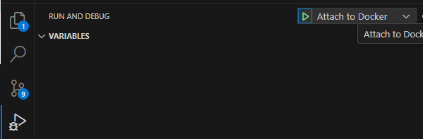

# Acela Backend Core

Backend core for decentralized video applications on HIVE. 

## Setup

### Install
`npm install`

### Have docker installed

Install docker using the reccommended steps for your system, then install docker compose.

### Create web network

`docker network create web`

### Environment variables

Rename `.example.env` to `.env.{STAGE}` then fill it out with relevant information

On a server:
`mv .env.example .env`
`nano .env`

## Development
`sudo docker compose -f docker-compose.local.yml up --build`

In development mode, if using vs code you can attach a debugger by going to the debugger tab and pressing attach to docker.

### To debug individual tests in vscode:
Look for green / red icons next to tests, right click > run & debug

## Deploy
### Staging
`sudo docker compose -f docker-compose.staging.yml up --build -d`
